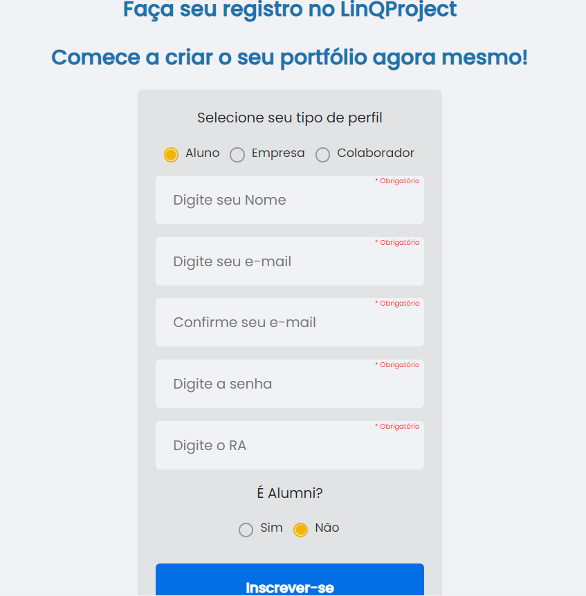

# LinQProject

## Descrição

O objetivo deste projeto é ser uma plataforma que possibilite a alunos terem um maior aproveitamento de seu período acadêmico, podendo submeter nela os projetos desenvolvidos ao longo dos cursos, adicionando imagens e documentos sobre os projetos. Nós temos também o objetivo de ser uma plataforma centralizadora, fazendo a conexão entre empresas e os projetos inovadores dos estudantes, de modo que surjam oportunidades de trabalho ou investimento caso as empresas se interessem pelos projetos.

## Tecnologias utilizadas

- React.js para o Frontend (Componentes Visuais)
- Java e Spring Boot para o Backend (Regras de negócio)
- Docker com MySQL para o banco de dados

## Tela 1: Login

Esta é a primeira tela do sistema. Nela é possível realizar o login, caso o usuário já tenha uma conta, ou então entrar na tela de cadastro para criar uma nova.

## Tela 2: Cadastro

Nesta tela, é possível realizar o cadastro como aluno, colaborador ou empresa. Caso seja empresa, não será possível cadastrar projetos, somente visualizá-los e entrar em contato com os donos dos projetos se algum projeto despertar o interesse.

## Tela 3: Projetos

Nesta tela é possível visualizar todos os projetos já cadastrados na plataforma, bem como entrar em cada um deles para ver os detalhes, como imagens e/ou documentos anexados.

## Tela 4: Detalhes dos Projetos

Nesta tela, estão sendo apresentados os detalhes dos projetos (imagens, documentos, links paras redes sociais dos donos, etc).

## Tela 5: Cadastro de Projetos

Caso o usuário seja um aluno ou colaborador, ele terá acesso a esta tela, para que possa começar a construir o seu portfólio na plataforma.

## Tela 6: Meus Projetos

Caso o usuário já tenha cadastrado algum projeto, ele poderá visualizá-los nesta tela.

## Tela 7: Sobre o LinQProject

Nesta tela o usuário poderá conferir o conceito de missão, visão e valores para a equipe MapperTech, desenvolvedora do projeto.

## Conclusão

Concluímos que, criando um portfólio em nossa plataforma, os estudantes de qualquer área podem gerar uma valiosa base de conhecimento que poderá ser aproveitada em oportunidades futuras com empresas que estejam dispostas em investir em ideias inovadoras, e os projetos casastrados na plataforma também podem servir como inspiração para alunos que estão começando um curso e desejam saber o que vão aprender ao longo do período acadêmico.   

__Contatos__  
Email: mappertech@email.com  
Linkedin: MapperTech  
Instagram: mapper-tech  
Facebook: Mapper Tech  